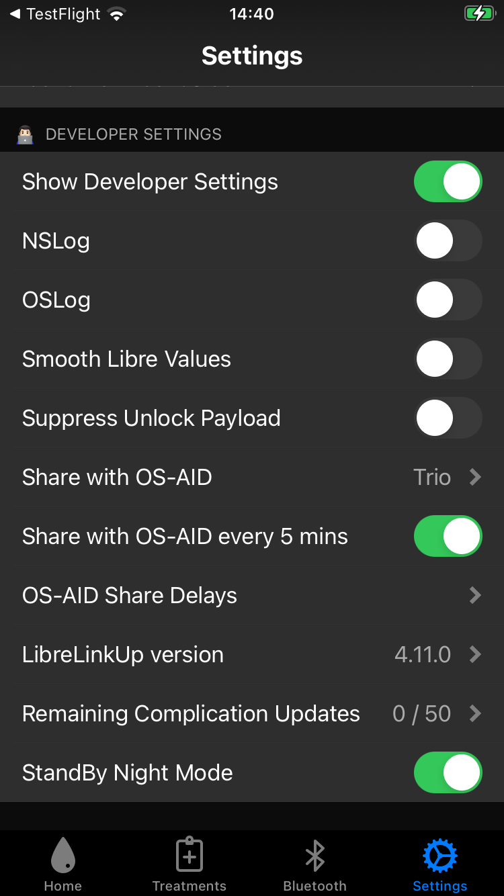

# OS-AID Integration

## OS-AID Overview

There are a number of Open Source Automated Insulin Delivery (OS-AID) systems. With version 5.3.3 and later, *xDrip4iOS* can interface with *Loop*, *Trio* and *iAPS*.

If you are able to connect your CGM directly to the OS-AID of your choice, that is the best way to run the app in closed-loop. If you prefer to use some of the features available only with *xDrip4iOS*, you can configure *xDrip4iOS* in [follower mode](../connect/index.md#master-or-follower) instead of being the one that talks to the CGM directly.

If you want, or need, *xDrip4iOS* to be the heartbeat for your OS-AID system, then follow these directions to configure *xDrip4iOS* to do that.

## Loop Customization

The *Loop* app requires a customization to include *xDrip4iOS* as an option for CGM.

Please follow these directions to customize Loop.

* [Add CGM to Loop](https://www.loopandlearn.org/custom-code/)

## Browser Build for *xDrip4iOS*

If you build *xDrip4iOS* using your Mac and Xcode, you don't need to know the details of the two App Groups used in [Configure App Group](#configure-app-group). They are automatically included and available.

If you build *xDrip4iOS* using [Browser Build](https://github.com/JohanDegraeve/xdripswift/blob/master/fastlane/testflight.md) (GitHub Actions), you need to create the [App Groups](https://developer.apple.com/account/resources/identifiers/list/applicationGroup) (if they don't already exist) and add both to your `com.TEAMID.xdripswift` Identifier. Tapping on the [Identifier](https://developer.apple.com/account/resources/identifiers/list), scroll down to the App Groups row and add both App Groups. After saving the configuration, then run create certificates followed by build for *xDrip4iOS*.

Note that the Name is simply a description and can be edited to suit your preference.  

| App Group Name |  App Group Identifier|
|---|:--|
| Loop App Group | group.com.TEAMID.loopkit.LoopGroup |
| Trio App Group | group.org.nightscout.TEAMID.trio.trio-app-group |

## Configure App Group

The CGM data from *xDrip4iOS* can be shared with your OS-AID app with both apps on the same phone.

Select *xDrip4iOS* Settings. Scroll all the way to the bottom and enable `Show Developer Settings` to reveal the screen shown below:

Tap on `Share with OS-AID` and choose one of the options:

* Disabled
* Loop/iAPS
* Trio

Once selected, then xDrip4iOS shares CGM data with the selected app.

There are additional settings to configure the sharing rate to every 5 minutes and to enable delays before sending the data to the OS-AID app.

TODO - explain some of these options.

___
## How do I install xDrip4iOS?

You need to follow the [Build From Source](../install/build.md) instructions.

