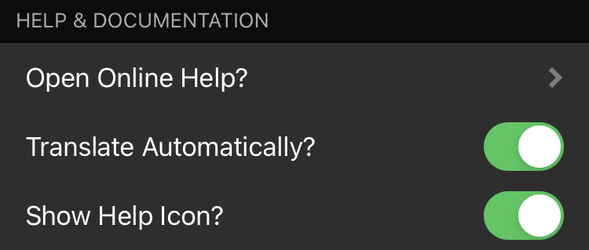
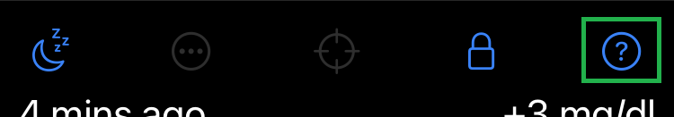
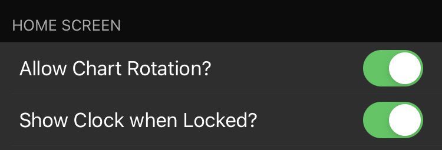
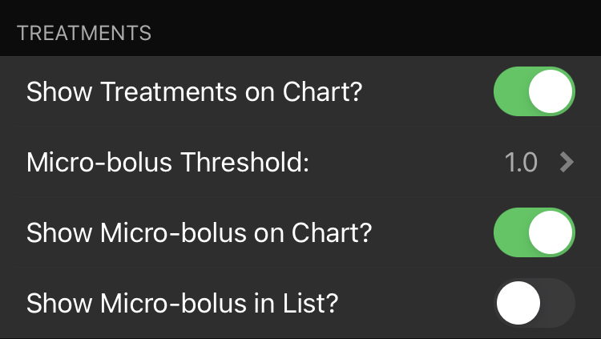
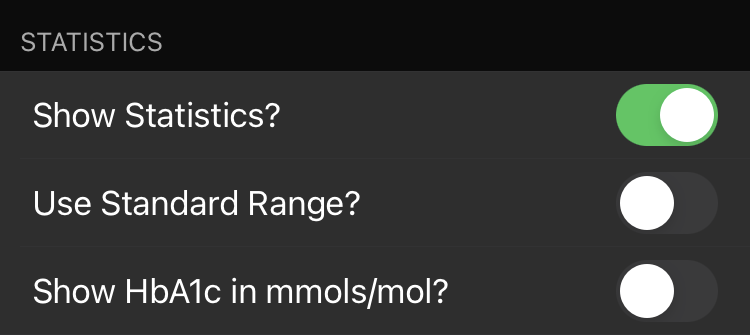
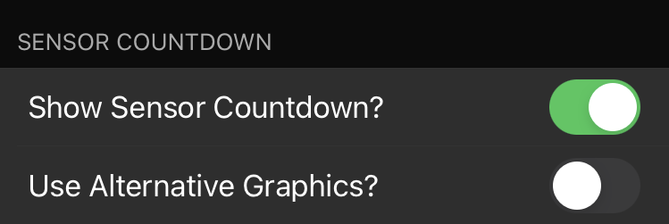

# General Settings

In a [previous section](../connect/index.md), you should have initially configured xDrip4iOS to use **mg/dl** or **mmol/l** and to act as a **Master** or **Follower** device.

Now we can start to configure the app to work as we want. When you first install xDrip4iOS, we will put some default values that should work fine for most users to start using the app with.

## Help

Open Online Help will drive you directly to this documentation. If you enabled Translate Automatically, you will see a Google automatic translation version of the documentation.

Show Help Icon will add a shortcut icon to the Home view:

___
## Show Notifications

You can enable xDrip4iOS to show a notification on your phone. This will appear as per the Notification settings for xDrip4iOS in your iPhone settings. You can enable banner notifications and chose if it will show on the lock-screen or not.  
You can leave the interval at which the notification will appear or leave it at default 0: whenever new BG value is available to xDrip4iOS.

You can also enable the App Badge which will should your current BG value on the app icon.

!!!info "Decimals"
    When using mmol/l the App Badge will display decimals only if Show BG in Notifications is enabled.

If you disable Notifications you can use multiply by 10 to show the full value (you'll need to mentally add the decimal point. 94 means 9.4 mmol/l).

___
## Home View

You can disable automatic rotation of the graph when you rotate your phone.

Show clock when Locked adds a large clock view on the Home screen when locked.

## Objective Values

We think of objective values as our working limits. We define theses limits as being:

- **in range**
- **out of range**
- **out of range (urgent)**.

###  In Range

Firstly we need to set a range where we want our glucose to be most of the time. This is set using ``Low Value`` and ``High Value``. Whilst our blood glucose value is between these limits, we will see the glucose points and values in **green**.

###  Out of Range

When our glucose values are below our Low value or above our High value, but still not anything to be worried about, then we will see them in **yellow**. We might use this as a sign that we should think about taking some kind of action (eat something or take insulin) before the values become "urgent".

###  Out of Range (Urgent)

When our glucose values are above or below our "Urgent" values, then we consider them to need urgent attention and we will see them in **red**. We set these limits using the ``Urgent Low Value`` and ``Urgent High Value`` We should take evaluate the situation and decide if we must take action (eat glucose or take insulin).

___
## Graph Options

xDrip4iOS allows us to show the main graph in two ways:

### Dynamic y axis

This option (used by default) will use our **objective values** (see above) to define the values shown on the vertical axis. It will also show guidelines across the graph so that we can easily see how close we are to each limit.

The graph will automatically scale if our blood glucose value is above our Urgent High value.

### Standard Grid

By deselecting the dynamic graph option, xDrip4iOS will just show a default grid system.

Again, the graph will scale as needed.

------

## Treatments

You can log [treatments](treatments) in xDrip4iOS, or receive them from Nightscout.  

If treatments are present you can display them on the Home chart.

Micro-boluses (typically generated by DIY AAPS systems) can be displayed without the amount of insulin (select the threshold below which it's not displayed) and visualized (or hidden) in the treatments list.

------

## Statistics

xDrip4iOS calculates basic statistics, you can display them on the Home screen.  
If you don't wish to use your objectives range you can leave the standard range.

------

## Sensor countdown

You can enable the display of your sensor actual lifetime, used or remaining days (alternative graphics).

