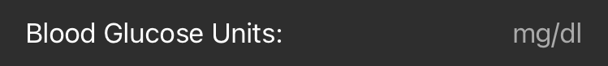

# Connect a Data Source

 

## Master or Follower?

In order to be able to see Blood Glucose data in xDrip4iOS, you need to connect it to a **data source**.

There are two types of data sources that you can use:

In **Master** mode, your iPhone will connect directly to a bluetooth-enabled CGM system (sensor/transmitter) in order to receive real-time data.

In **Follower** mode, your iPhone will connect to a Nightscout site over the internet  and pull real-time data. 

Put simply, a **Master** is usually used by the actual person who is wearing the sensor and a **Follower** is usually a parent/friend/caregiver that wants to be able to track (follow) the other person's CGM values.

Once we've decided whether we want to use xDrip4iOS as a **Master** or a **Follower** device, we need to click on the Settings tab and chose the mode we want. Click on the option if you need to change it between the two modes.

 

## Blood Glucose Unit

The next step is to make sure that the Blood Glucose unit is correctly set. 

If you are used to seeing your BG values as small numbers with a single decimal place such as 4.7, 6.3 or 10.4 then you are using **mmol/l**.
 
*(Common in Canada, Northen Europe, Australia, South Africa, China etc)*

If you usually see your BG values as bigger numbers such as 76, 127 or 215 then you are using **mg/dl**.
 
*(Common in USA, Southern Europe, India, Japan, Central/South America etc)*

Once you've set your device mode and BG unit, you're ready to connect a data source.

Click [here](cgm.md) to connect to your CGM as a Master

Click [here](follower.md) to connect to Nightscout as a Follower