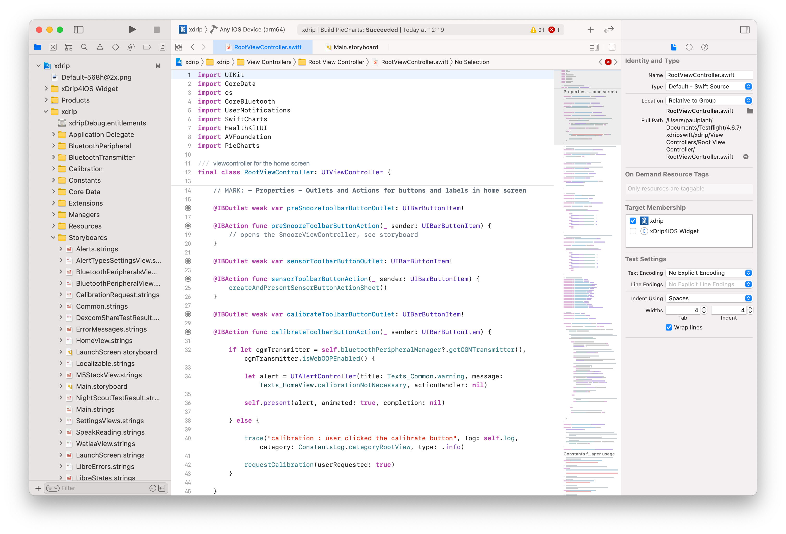

# How to Build xDrip4iOS using Xcode

Although for most users, the recommended method for installing xDrip4iOS is to just use [Testflight](testflight.md), many users will want to build directly from source. If so, this page is for you!

xDrip4iOS is an open-source project and is released under the [**GNU General Public License v3.0**](https://github.com/JohanDegraeve/xdripswift/blob/master/LICENSE).

Most users that decide to build from source will be people who are interested in collaborating in the development of the project or users who are used to DIY solutions (such as Loop or FreeAPS), have a valid Apple Developer license/account and are comfortable working with Xcode.

Although **xDrip4iOS** is the common *public* name for the application, the actual Github project name is **xdripswift** and you will often so it referred to as this in the following documentation.

The main project repository is [here](https://github.com/JohanDegraeve/xdripswift)

Ready? So then let's begin. Here are some of the things that you'll need before you're able to build and install the app:

- A Mac computer (iMac, MacBook etc).
- A valid Apple Developer account/license. If not, you could theoretically use a free Apple ID to sign the app with but you will have to remove Healthkit and NFC integration capabilities as well as needing to re-sign the app every 7 days. ***It's really not worth considering this path if you do not have a current Apple Developer account***
- Xcode installed. This can be done from the App Store on your Mac.
- Git installed. If you're unsure how to do this, please follow the guide [here](https://git-scm.com/book/en/v2/Getting-Started-Installing-Git).
- A compatible cable to connect your iPhone (Lightning port) to your Mac (USB-C or USB-A as needed)
  
It is recommeneded to always use the latest versions of MacOS and Xcode. Your iPhone should ideally also be using the latest version of iOS.

!!!info "APPLE "M1" PROCESSOR?"
If you are using a newer (2020-2021) Mac Mini, MacBook Air or MacBook Pro with the new M1 processor (aka *Apple Silicon*) please note that there will be some small changes needed in the below steps. They will be clearly marked.

Please make sure you are running Terminal under Rosetta:

- Right-click on Terminal in Finder
- Click "Get Info"
- Select "Open with Rosetta"

Then run the following command to install ffi:

    sudo gem install ffi

After this, you should be able to install the Cocoapods framework to your Mac as normal:

    sudo gem install cocoapods

Then once you've cloned the project you can go into the project folder and install the local dependencies:

    pod install

___
### Install the Cocoa Pods Framework to your Mac

If this is the first time that you have built xDrip4iOS on your Mac, then you will need to install a set of frameworks called CocoaPods. If you have previously installed CocoaPods, you can skip this step.

Enter the following command into Terminal. This must be done with admin rights, so we will use **sudo** (it will ask for your admin password):

    sudo gem install cocoapods

This should install the dependencies onto your system and give you an OK message.

### Clone the xdripswift project

You should go into your Documents folder (or wherever you prefer) and run the following command to clone the xDrip4iOS project:

    git clone --branch=master --recurse-submodules https://github.com/JohanDegraeve/xdripswift

This will create a new folder called xdripswift. Once completed we should navigate into this folder:

    cd xdripswift

### Install Cocoa Pods Dependencies

Earlier we installed the full Cocoa Pods framework onto your system. Now we will go into the cloned project folder and install the individual project dependencies there:

    pod install

Again, you will see some activity and you should get an OK message.

Open the WorkSpace file by typing:

   xed .

### Set the Bundle Identifier

Here you should create a unique Bundle Identifier for each target. The default value in the project is:

net.johandegraeve.xdripswift 
net.johandegraeve.xdripswift.xDrip4iOS-Widget

Obviously, this is already in use by Johan so we need to change them.

You should change the part that says "**net.johndegraeve**" to something that nobody else is using. You can use anything you want such as:

- **com.ilovetheweekend**.xdripswift
- **com.ilovetheweekend**.xdripswift.xDrip4iOS-Widget
  

- **net.keithrichards**.xdripswift
- **net.keithrichards**.xdripswift.xDrip4iOS-Widget
  

- **com.anything-i-want**.xdripswift
- **com.anything-i-want**.xdripswift.xDrip4iOS-Widget

Just invent something and try it. If somebody else is already using this identifier, then you'll get an error and can just chose another one.

Now you should sign both targets with your Development Team, connect your iPhone to your Mac, select your device and hit **Build** ("Play")

 
